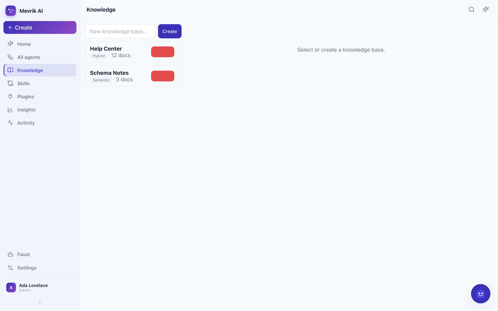
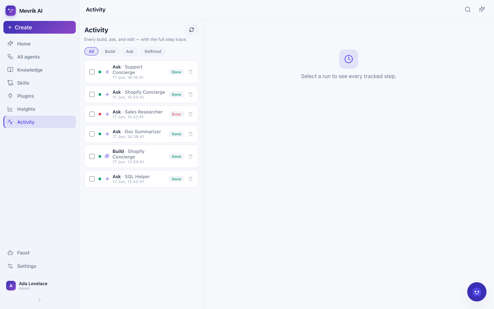

# Veldra — talk an agent into existence

**Veldra is a self-hostable, local-first agent-harness platform.** Install it, open
the web app, and describe what you want in plain language. An orchestrator AI
compiles your request into a *working agent* — writing its policy, selecting its
tools and **skills**, attaching a RAG knowledge base, choosing a reasoning method,
and even wiring a whole **team** of agents for a company. Reshape anything later by
talking to it; agents **learn from your feedback** and improve themselves over time.

> **The one load-bearing idea:** an agent is *data*, not code — a versioned
> `AgentSpec` row in Postgres. "Build me an agent" = compile natural language →
> validated `AgentSpec`. "Change it" = a JSON-Patch you approve. The runtime is a
> pure interpreter of that spec.

## ✨ What it does

- **Talk an agent — or a company team — into existence.** Describe a single agent,
  or pick *Company team* and describe your business: the orchestrator plans a
  coordinator + specialist agents and wires them together.
- **Skills (`.md` playbooks).** Write reusable Markdown playbooks; the orchestrator
  attaches the relevant ones when building, and their content is injected into the
  agent's instructions at runtime.
- **Editable knowledge bases.** Upload PDFs/markdown or **index a web page**; edit a
  saved document and it re-embeds; view its **page-index tree**; choose the retrieval
  mode (**semantic / keyword / hybrid**), a per-KB **embedding model**, optional
  **reranker**, and **vector storage** (pgvector or Qdrant).
- **A Dify-class visual workflow builder.** start · end · llm · classifier ·
  kb_search · if_else · condition · code (sandboxed) · tool · http · template ·
  aggregator — with a per-node inspector and typed variable passing.
- **Self-improvement (Reflexion).** 👍/👎 any answer; on 👎 an auto-improving agent
  reflects and stores a *lesson* (episodic memory) that's injected next time.
- **Faust**, the floating admin bot with a soul. Ask it to rename / tag / re-policy /
  delete agents, inspect & clear activity logs, or delete documents — it acts through
  audited admin tools and learns from feedback like any agent.
- **Full activity log** of every build / ask / edit with the complete step trace.
- **⌘K command palette**, selection + tags + bulk-delete across agents / logs / docs.

## ✅ Status — verified running locally

Run end-to-end against a **local Ollama** (`qwen3.5:0.8b`), no cloud key required, and
deployed via Docker. Verified: upload/web-ingest → embed → retrieve with citations;
NL → `AgentSpec`; the streaming agent loop + tool suite; **company team** builds;
**skills** injection; **self-improvement** (feedback → lesson → injection); the visual
builder executing rich workflows; and Faust admin operations. Small local models
produce valid structure but basic prose / flaky multi-arg tool calls — point
`VELDRA_OLLAMA_ORCHESTRATOR_MODEL` at a bigger model (see [Models](#models)).

## 🖥️ Where's the front-end?

It's the Vue 3 app in **`apps/web/`**. In Docker it's built into the app image and
served at **http://localhost:8000**; in dev mode it runs on **http://localhost:5173**
(proxying `/api` to the backend, so it's same-origin — no CORS).

It's a chat-to-build UI: upload documents, describe the agent you want (left), watch
the orchestrator stream its plan and render the generated **spec** — policy, tools,
skills, knowledge bases, team, and the workflow — on the right; then chat with the
agent (streamed answers + clickable citations), and refine it with a diff-approval
modal. The shell has five sections — **Studio · Knowledge · Skills · Agents ·
Activity** — plus a ⌘K command palette and the floating **Faust** assistant.

## 📸 Screenshots

Drop PNGs into `docs/screenshots/` and they render here:

| | |
|---|---|
|  |  |
| **Studio** — build an agent or a company team | **Builder** — the visual workflow canvas |
|  |  |
| **Knowledge** — editable KB + retrieval config | **Activity** — every run with its step trace |

> To capture them: `make up`, open http://localhost:8000, and screenshot each section
> (the filenames above). They're git-ignored placeholders until you add them.

## Quick start — one command

Prereqs: **Docker** + a running [Ollama](https://ollama.com). Pull a couple of models,
then bring up the entire stack (Postgres+pgvector, Redis, MinIO, and the app) with one
command:

```bash
ollama pull qwen3.5:0.8b          # agent model (tools + thinking)
ollama pull nomic-embed-text      # embeddings (768-dim)
make up                           # = docker compose -f deploy/docker-compose.yml up --build
```

Open **http://localhost:8000**. `make down` stops it, `make logs` tails the app.
(The image is built end-to-end and verified: UI + API in one container, reaching your
host Ollama via `host.docker.internal`.)

## Quick start — dev (hot reload)

Prereqs: also [uv](https://docs.astral.sh/uv/) + Node 20.19+.

```bash
cp example.env .env
make dev                          # infra in Docker + migrate; prints the two run commands
uv run uvicorn veldra_app.main:app --reload      # API on :8000
cd apps/web && npm install && npm run dev        # UI on :5173
```

> The Postgres container maps host port **5433** (to avoid clashing with a local
> Postgres on 5432); inside Docker the app talks to it on the internal network.

Then, in the web app: upload a doc or two → *"Answer questions from these docs and
always cite the page"* → ask away. Or via the CLI:

```bash
uv run veldra kb add ./whitepaper.pdf
uv run veldra build "answer from my docs with citations"
uv run veldra ask "what does section 3 say about pricing?"
```

## What you can build

- **Single agents** — a policy + model + thinking method, optionally with tools and a KB.
- **Tool-using agents** — first-party tools the orchestrator can grant:
  `kb.search` (RAG over your docs), `time.now`, `math.eval`, `http.fetch`, and
  workspace files `fs.read` / `fs.write` / `fs.list` (so agents can *create* artifacts).
  All bounded and local-first; untrusted code execution is gated behind the v1 sandbox.
- **Skills** — reusable Markdown playbooks (a Skills section to author them). The
  orchestrator attaches relevant skills when building; their content is injected into
  the agent's instructions at runtime.
- **Agent teams** — say "build a team…" (or pick *Company team*) and the orchestrator
  plans a coordinator + specialist agents and **creates them all**, wiring `sub_agents`
  so the coordinator delegates (depth-capped).
- **Workflows** — a `workflow_graph` the runtime executes with a typed variable pool.
  Node types: start · end · llm · classifier · kb_search · if_else · condition · code
  (sandboxed expression) · tool · http · template · aggregator. Build it by asking, or
  on the **visual canvas** (per-node inspector, branch edges, code editor).
- **Knowledge bases** — upload PDF/markdown/text **or index a web page**; edit a saved
  document (re-embeds) and view its **page-index tree**; per-KB **retrieval mode**
  (semantic/keyword/hybrid), **embedding model**, **reranker**, and **vector store**
  (pgvector / Qdrant). Citations carry `page`/`section`/`char-span`.
- **Self-modification + self-improvement** — refine by talking (a JSON-Patch you
  approve; immutable versions, rollback = repin; new tools gated as "sensitive"). And
  with **auto-improve** on, 👎 feedback makes the agent reflect and store a lesson it
  applies next time.
- **Faust** — the floating admin bot: manage agents / logs / documents by chatting.

## Models / providers

The LLM layer is **provider-pluggable** via `VELDRA_LLM_PROVIDER`:

| Provider | `VELDRA_LLM_PROVIDER` | Notes |
|---|---|---|
| **Ollama** (default) | `ollama` | Fully local, no key. `VELDRA_OLLAMA_MODEL` (+ optional `VELDRA_OLLAMA_ORCHESTRATOR_MODEL` for a stronger compile model). Uses Ollama `format` for structured output + function-calling. |
| **OpenAI-compatible** | `openai` | OpenAI, Groq, OpenRouter, vLLM, LM Studio — set `VELDRA_OPENAI_BASE_URL`, `OPENAI_API_KEY`, `VELDRA_OPENAI_MODEL`. |
| **Anthropic** | `anthropic` | Claude with adaptive thinking + `effort`: orchestrator `claude-opus-4-8`, agents `claude-sonnet-4-6`. Needs `ANTHROPIC_API_KEY`. |

Embeddings are independently pluggable (`VELDRA_EMBED_PROVIDER`): local Ollama
`nomic-embed-text` (768-dim) by default, or OpenAI `text-embedding-3-small` (1536).
The dimension is fixed at first migration.

### Agent loop modes (`VELDRA_AGENT_MODE`)

To stay reliable even on **sub-1B local models**, the runtime defaults (`auto`) to a
**constrained decision loop** for local/small models instead of fragile native
tool-calling: each step the model picks an action from an enum (`tools + final`) and
fills exactly that tool's args via structured output (with goal-aware prompting,
required-field fallback, a no-progress breaker, bounded repair, and graceful step-limit
fallback). The final answer is a separate, streamed, *grounded* composition ("answer
only from the observations; if absent, say so"). Claude/large models keep native
tool-calling. Force either with `VELDRA_AGENT_MODE=decision|native`.

The two-phase loop is hardened from *probed* tiny-model behaviour (Ollama's `format`
does **not** strictly enforce `required`/`additionalProperties`): the arg-fill phase is
driven by a clean, example-driven instruction naming the exact fields, keys outside the
schema are dropped, blank required fields fall back only for free-text fields (never
poisoning a typed one like `expression`), and a RAG agent is forced to search its KB
before answering. A repeatable suite measures this — `task eval:loop` (or
`python -m evals.decision_loop.run`) seeds controlled tool-specs and asserts, on
`qwen3.5:0.8b`: 100% answered, **0 hallucinated tools**, each tool called once with
non-empty args, and RAG answers cited.

> **Tiny-model caveat:** a sub-1B model (like `qwen3.5:0.8b`) emits schema-valid
> output via constrained decoding and *can* call tools, but it designs weak specs
> (often grants no tools from a vague request) and writes rambly answers. For a
> genuinely capable orchestrator, point `VELDRA_OLLAMA_ORCHESTRATOR_MODEL` at a bigger
> local model (`qwen3:1.7b`, `gemma3`, `gpt-oss:120b-cloud`) or use the `openai` /
> `anthropic` providers.

## Repository layout

```
apps/web/        Vue 3 + Vite + Pinia + TS — the chat-to-build front-end
services/app/    one FastAPI process: edge (REST+SSE) · orchestrator · runtime · rag
packages/        spec-schema · llm-providers · mcp-client · mcp-servers · thinking-methods
cli/             thin Typer client (veldra kb add | build | ask | agents | selfmod)
deploy/          docker-compose (postgres+pgvector, redis, minio) + SQL migrations
evals/           nl_to_spec golden accuracy · decision_loop reliability suite
docs/            ARCHITECTURE.md — full design + phased roadmap
```

See [docs/ARCHITECTURE.md](docs/ARCHITECTURE.md) for the design, the provider
interface, the Python/Go boundary, and the roadmap (v1 execution sandbox + Go
gateway, v2 visual workflow DAG engine + richer multi-agent, v3 durable spine).

## Status & history

MVP. The previous Django GPT-3.5 chatbot is preserved on `origin/main` and the
`archive/v1-django` tag.
