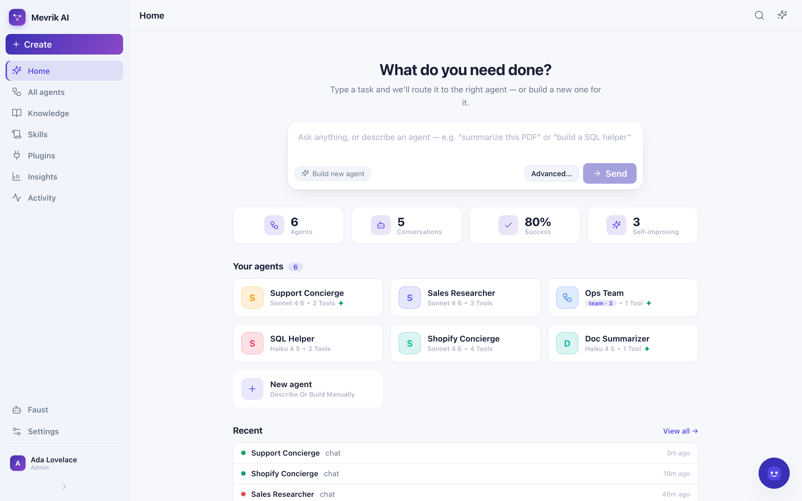
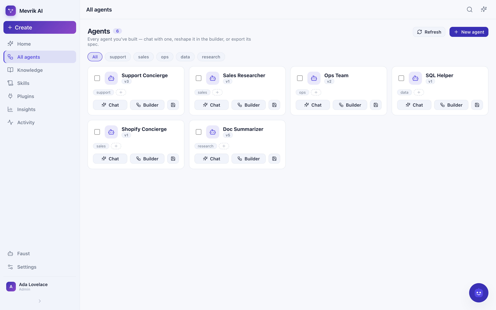
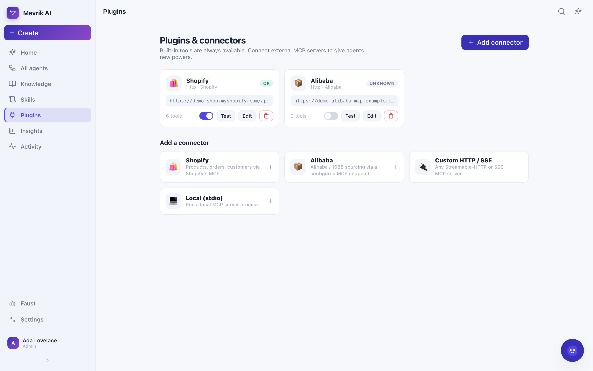
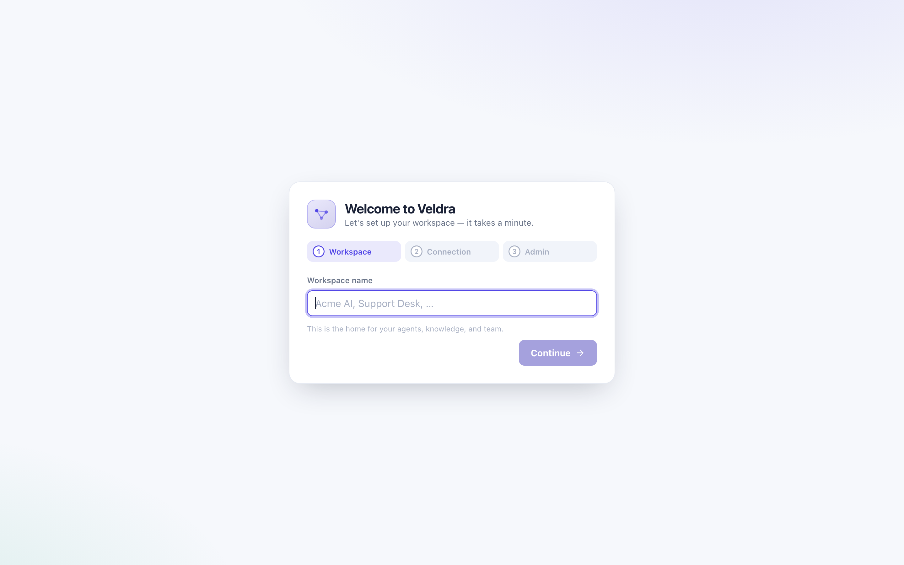
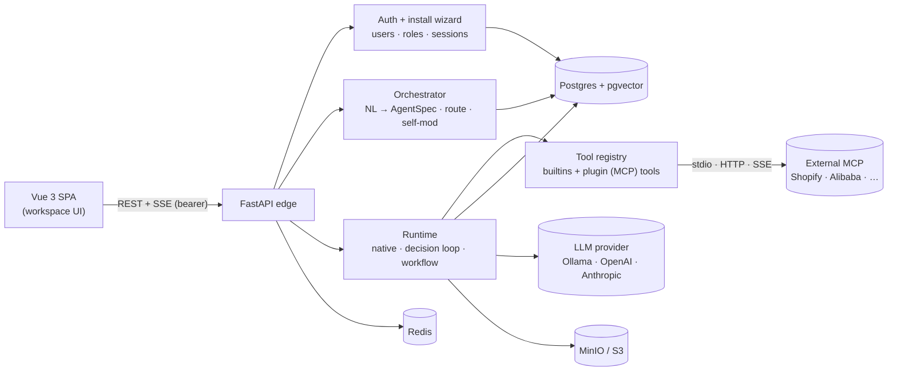

<div align="center">

# Veldra

### Talk an agent into existence.

**A self-hostable, local-first agent-harness platform.** Describe what you need in
plain language — Veldra compiles it into a *working agent*: its policy, tools,
**skills**, a RAG knowledge base, a reasoning method, even a whole **team**. Route a
task to the right agent automatically, connect external tools over **MCP**, and reshape
anything later just by talking to it. Agents **learn from your feedback** and improve.


</div>



> **The one load-bearing idea:** an agent is *data*, not code — a versioned
> `AgentSpec` row in Postgres. "Build me an agent" = compile natural language →
> validated `AgentSpec`. "Change it" = a JSON-Patch you approve. The runtime is a
> pure interpreter of that spec.

---

## ✨ Highlights

- **Type a task — it routes or builds.** A smart composer auto-selects the best
  existing agent for what you typed, or builds a new agent from the prompt and drops
  you straight into its chat.
- **A real workspace, with sign-in.** A first-run **install wizard** (name the
  workspace, check your providers, create the admin), then a sign-in gate. Invite
  teammates with roles — **admin / member / viewer**.
- **Plugins & MCP connectors.** Built-in tools (calculator, web scraper, RAG search,
  HTTP, workspace files, …) are always on. Install external **MCP connectors**
  (Shopify, Alibaba, or any Streamable-HTTP / SSE / stdio server) from a template
  gallery — configure credentials, test the connection, enable per agent. Side-effecting
  connector tools require explicit approval.
- **Agent teams.** Describe a business and the orchestrator plans a coordinator +
  specialists and wires them together (depth-capped delegation).
- **Editable knowledge bases.** Upload PDFs/markdown or **index a web page**; edit a
  document and it re-embeds; per-KB **retrieval mode** (semantic / keyword / hybrid),
  **embedding model**, **reranker**, and **vector store** (pgvector / Qdrant). Citations
  carry `page` / `section` / `char-span`.
- **A visual workflow builder.** start · end · llm · classifier · kb_search · if_else ·
  condition · code (sandboxed) · tool · http · template · aggregator — per-node inspector
  and typed variable passing.
- **Self-improvement (Reflexion).** 👍/👎 any answer; on 👎 an auto-improving agent
  reflects and stores a *lesson* it applies next time.
- **Faust**, the floating admin bot: rename / tag / re-policy / delete agents, inspect &
  clear logs, manage documents — through audited admin tools.
- **Insights & Activity** — usage / cost / reliability rollups and the full step trace
  of every build / ask / edit.

## 📸 Screenshots

| | |
|---|---|
|  |  |
| **Home** — smart composer, KPI strip, agent board | **All agents** — gallery, tags, chat / builder |
|  |  |
| **Plugins** — MCP connectors + template gallery | **Install wizard** — first-run setup |

## 🏗️ Architecture at a glance



Everything is one FastAPI process (edge + orchestrator + runtime + RAG) plus the Vue
SPA. An agent is a stable `agents` row + an append-only stack of immutable
`AgentSpec` versions; the runtime is a pure interpreter of the current version.

## 🚀 Quick start — one command

Prereqs: **Docker** + a running [Ollama](https://ollama.com). Pull a couple of models,
then bring up the whole stack (Postgres+pgvector, Redis, MinIO, and the app):

```bash
ollama pull qwen3.5:0.8b          # agent model (tools + thinking)
ollama pull nomic-embed-text      # embeddings (768-dim)
make up                           # = docker compose -f deploy/docker-compose.yml up --build
```

Open **http://localhost:8000**. On first run you'll get the **install wizard** — name
your workspace, test the provider connection, and create the admin account. After that,
sign in and start building. `make down` stops it, `make logs` tails the app.

## 🧑‍💻 Quick start — dev (hot reload)

Prereqs: also [uv](https://docs.astral.sh/uv/) + Node 20.19+.

```bash
cp example.env .env
make dev                          # infra in Docker + migrate; prints the run commands
uv run uvicorn veldra_app.main:app --reload      # API on :8000
cd apps/web && npm install && npm run dev        # UI on :5173 (proxies /api → :8000)
```

Then describe what you want (e.g. *"answer questions from these docs and always cite
the page"*) — Veldra builds the agent and you chat with it. Or use the CLI (set
`VELDRA_AUTH_ENABLED=false` for local, or `VELDRA_SERVICE_TOKEN`):

```bash
uv run veldra kb add ./whitepaper.pdf
uv run veldra build "answer from my docs with citations"
uv run veldra ask "what does section 3 say about pricing?"
```

## 🧩 What you can build

| Build this | How |
|---|---|
| **A single agent** | Type a task or a description — the orchestrator writes the policy, picks tools/skills/KB and a thinking method. |
| **A whole team** | "Build a team to run an online store" → a coordinator + specialists, wired via `sub_agents`. |
| **Tool-using agents** | Grant built-ins (`kb.search`, `calc.eval`, `web.scrape`, `http.fetch`, `time.now`, `fs.*`, `json.query`, `regex.extract`) or **plugin** tools from connected MCP servers. |
| **Connected agents** | Install MCP connectors (Shopify, Alibaba, or any HTTP/SSE/stdio server); their tools appear in the catalog and the orchestrator can grant them. |
| **RAG agents** | Attach an editable knowledge base; answers cite `page` / `section`. |
| **Workflows** | A typed `workflow_graph` the runtime executes — author by asking or on the visual canvas. |
| **Self-improving agents** | Turn on auto-improve; 👎 feedback → reflection → a stored lesson injected next time. |

## 🔌 Plugins & MCP connectors

Built-in tools are always available. To give agents new powers, an **admin** opens
**Plugins → Add connector** and picks a template:

| Connector | Transport | Configure |
|---|---|---|
| **Shopify** | Streamable HTTP | server URL + access token |
| **Alibaba** | Streamable HTTP | MCP endpoint + API key |
| **Custom HTTP / SSE** | HTTP / SSE | any MCP server URL (+ optional headers) |
| **Local (stdio)** | stdio | a command to run, e.g. `npx -y some-mcp-server` |

Credentials are stored server-side and never returned to the browser. **Test
connection** lists the server's tools; once enabled, they appear as `<key>.<tool>` in
the catalog. A connector tool set to `permission_mode: ask` requires explicit approval
before it runs.

## 🤖 Models / providers

The LLM layer is **provider-pluggable** via `VELDRA_LLM_PROVIDER`:

| Provider | value | Notes |
|---|---|---|
| **Ollama** (default) | `ollama` | Fully local, no key. `VELDRA_OLLAMA_MODEL` (+ optional `VELDRA_OLLAMA_ORCHESTRATOR_MODEL`). |
| **OpenAI-compatible** | `openai` | OpenAI, Groq, OpenRouter, vLLM, LM Studio — set `VELDRA_OPENAI_BASE_URL`, `OPENAI_API_KEY`, `VELDRA_OPENAI_MODEL`. |
| **Anthropic** | `anthropic` | Claude with adaptive thinking + `effort`. Needs `ANTHROPIC_API_KEY`. |

Embeddings are independently pluggable (`VELDRA_EMBED_PROVIDER`): local Ollama
`nomic-embed-text` (768-dim) by default, or OpenAI `text-embedding-3-small` (1536). The
dimension is fixed at first migration.

### Agent loop modes (`VELDRA_AGENT_MODE`)

To stay reliable even on **sub-1B local models**, `auto` runs a **constrained decision
loop** for local/small models instead of fragile native tool-calling: each step the
model picks an action from an enum and fills exactly that tool's args via structured
output (goal-aware prompting, required-field fallback, a no-progress breaker, bounded
repair, graceful step-limit fallback). The final answer is a separate, streamed,
*grounded* composition. Claude/large models keep native tool-calling. Force either with
`VELDRA_AGENT_MODE=decision|native`. A repeatable suite (`python -m evals.decision_loop.run`)
asserts, on `qwen3.5:0.8b`: 100% answered, **0 hallucinated tools**, each tool called
once with non-empty args, and RAG answers cited.

## 🔐 Auth & access

Multi-user, single workspace. First run shows the install wizard; thereafter a sign-in
gate. Sessions are opaque bearer tokens (stored only as a SHA-256 hash, revocable +
expiring); passwords use PBKDF2-SHA256 (stdlib, no native deps). Roles:

- **admin** — everything, plus team management + plugins + Faust.
- **member** — build / chat / edit agents, KBs, skills.
- **viewer** — read-only.

Set `VELDRA_AUTH_ENABLED=false` to resolve every request to the default workspace as a
system admin (CLI, evals, trusted local single-user dev). See `example.env`.

## 🗂️ Repository layout

```
apps/web/        Vue 3 + Vite + Pinia + TS — the workspace front-end
services/app/    one FastAPI process: edge (REST+SSE) · auth · orchestrator · runtime · rag
packages/        spec-schema · llm-providers · mcp-client · mcp-servers · thinking-methods
cli/             thin Typer client (veldra kb add | build | ask | agents | selfmod)
deploy/          docker-compose (postgres+pgvector, redis, minio) + Alembic migrations
evals/           nl_to_spec golden accuracy · decision_loop reliability suite
docs/            ARCHITECTURE.md + screenshots/
```

## 🩺 Troubleshooting

| Symptom | Fix |
|---|---|
| App can't reach Ollama from Docker | The container reaches your host at `host.docker.internal`; make sure Ollama is running and the models are pulled. |
| `port 5432 already in use` | The Postgres container maps host port **5433** (to avoid clashing with a local Postgres). The app talks to it on the Docker network. |
| Embedding dimension mismatch | `VELDRA_EMBED_DIM` is fixed at first migration. Use an embedder of the same dimension, or re-index (or use Qdrant for mixed dims). |
| Stuck on the install wizard | It only shows when no users exist and `VELDRA_AUTH_ENABLED=true`. To bypass auth entirely, set it to `false`. |
| CLI gets 401 | With auth on, set `VELDRA_AUTH_ENABLED=false` for local use, or send `VELDRA_SERVICE_TOKEN` as a bearer token. |
| A connector shows "error" | Open **Plugins**, hit **Test** — the error from the MCP server is shown. Check the URL, credentials, and that the server is reachable. |

## 📖 Glossary

- **AgentSpec** — the validated, versioned JSON that *is* an agent (policy, model,
  tools, skills, KBs, team, workflow).
- **Skill** — a reusable Markdown playbook injected into an agent's instructions.
- **Connector / Plugin** — an external MCP server whose tools an agent can use.
- **Decision loop** — the constrained, structured-output agent loop for small models.
- **Lesson** — episodic memory learned from feedback, injected on future runs.
- **Faust** — the admin meta-agent that manages the workspace by chatting.

See [docs/ARCHITECTURE.md](docs/ARCHITECTURE.md) for the full design, the provider
interface, and the roadmap. The previous Django GPT-3.5 chatbot is preserved on the
`archive/v1-django` tag.
